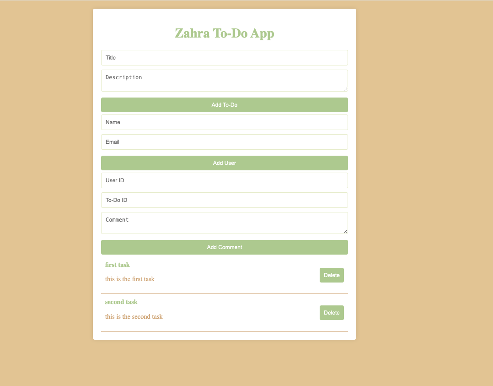
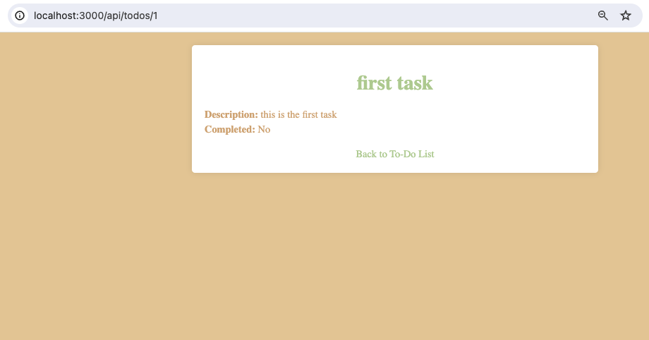

# Zahra To-Do App with Express

This project is a simple To-Do application built using Node.js, Express, and EJS. The application allows users to create, update, delete, and view to-dos, users, and comments.

## Features

- Add, view, update, and delete to-dos
- Add, view, update, and delete users
- Add, view, update, and delete comments
- Form validation for adding to-dos, users, and comments

## Screenshots


*Home Page of the To-Do App*


*Specific task page shown by id URL*

## Technologies Used

- **Node.js**: JavaScript runtime built on Chrome's V8 JavaScript engine.
- **Express**: Fast, unopinionated, minimalist web framework for Node.js.
- **EJS (Embedded JavaScript)**: Simple templating language that lets you generate HTML markup with plain JavaScript.
- **HTML5, CSS and Javascript**
- **Body-Parser**: Node.js body parsing middleware.
- **Method-Override**: Lets you use HTTP verbs such as PUT or DELETE in places where the client doesn’t support it.


## Installation and usage

1. Clone the repository:

```
git clone https://github.com/zahrajoulaei/ExpressApplication

```

2.	Navigate to the project directory:
```
cd ExpressApplication

```

3.	Install the dependencies:
```
npm install
```


4. start the server

```
node index.js
```

Open your browser and navigate to http://localhost:3000

## API Endpoints

### To-Dos
- `GET /api/todos` - Get all to-dos
- `POST /api/todos` - Create a new to-do
- `GET /api/todos/:id` - Get a specific to-do by ID
- `PATCH /api/todos/:id` - Update a specific to-do by ID
- `DELETE /api/todos/:id` - Delete a specific to-do by ID

### Users

- `GET /api/users` - Get all users
- `POST /api/users` - Create a new user
- `GET /api/users/:id` - Get a specific user by ID
- `PATCH /api/users/:id` - Update a specific user by ID
- `DELETE /api/users/:id` - Delete a specific user by ID

### Comments

- `GET /api/comments` - Get all comments
- `POST /api/comments` - Create a new comment
- `GET /api/comments/:id` - Get a specific comment by ID
- `PATCH /api/comments/:id` - Update a specific comment by ID
- `DELETE /api/comments/:id` - Delete a specific comment by ID


## Middleware

- **Custom Middleware**: Used for logging requests and generating unique IDs.
- **Error Handling Middleware**: Catches and handles errors throughout the application.


